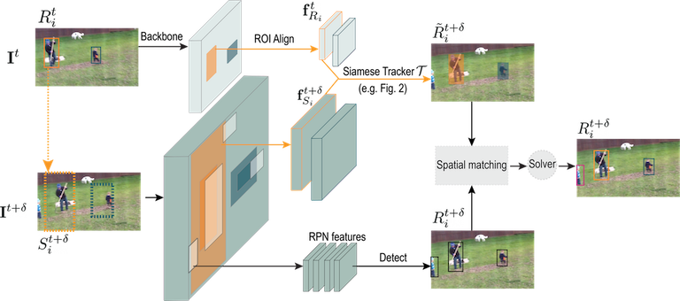

# SiamMOT

SiamMOT is a region-based Siamese Multi-Object Tracking network that detects and associates object instances simultaneously.

> [**SiamMOT: Siamese Multi-Object Tracking**](https://www.amazon.science/publications/siammot-siamese-multi-object-tracking),            
> Bing Shuai, Andrew Berneshawi, Xinyu Li, Davide Modolo, Joseph Tighe,        

    @inproceedings{shuai2021siammot,
      title={SiamMOT: Siamese Multi-Object Tracking},
      author={Shuai, Bing and Berneshawi, Andrew and Li, Xinyu and Modolo, Davide and Tighe, Joseph},
      booktitle={CVPR},
      year={2021}
    }
    

    
## Abstract
In this paper, we focus on improving online multi-object tracking (MOT). In particular, we introduce a region-based Siamese Multi-Object Tracking network, which we name SiamMOT. SiamMOT includes a motion model that estimates the instance’s movement between two frames such that detected instances are associated. To explore how the motion modelling affects its tracking capability, we present two variants of Siamese tracker, one that implicitly models motion and one that models it explicitly. We carry out extensive quantitative experiments on three different MOT datasets: MOT17, TAO-person and Caltech Roadside Pedestrians, showing the importance of motion modelling for MOT and the ability of SiamMOT to substantially outperform the state-of-the-art. Finally, SiamMOT also outperforms the winners of ACM MM’20 HiEve Grand Challenge on HiEve dataset. Moreover, SiamMOT is efficient, and it runs at 17 FPS for 720P videos on a single modern GPU.

## Installation

Please refer to [INSTALL.md](readme/INSTALL.md) for installation instructions.

## Try SiamMOT demo
For demo  purposes,  we provide two tracking models -- tracking person (visible part) or jointly tracking person and vehicles (bus, car, truck, motorcycle, etc).
The person tracking model is trained on COCO-17 and CrowdHuman, while the latter model is trained on COCO-17 and VOC12.
Currently, both models used in demos use EMM as its motion model, which performs best among different alternatives.

In order to run the demo, use the following command:
~~~
python3 demos/demo.py --demo-video  PATH_TO_DEMO_VIDE --track-class person --dump-video True
~~~
You can choose `person` or  `person_vehicel` for `track-class` such that person tracking or person/vehicle tracking model is used accordingly.

The model would be automatically downloaded to `demos/models`,
and the visualization of tracking outputs is automatically saved to `demos/demo_vis`

 

We also provide several pre-trained models in [model_zoos.md](readme/model_zoo.md) that can be used for demo. 

## Dataset Evaluation and Training
After [installation](readme/INSTALL.md), follow the instructions in [DATA.md](readme/DATA.md) to setup the datasets.
As a sanity check, the models presented in [model_zoos.md](readme/model_zoo.md) can be used to for benchmark testing. 

Use the following command to train a model on an 8-GPU machine:
Before running training / inference, setup the [configuration file](configs) properly
~~~
python3 -m torch.distributed.launch --nproc_per_node=8 tools/train_net.py --config-file configs/dla/DLA_34_FPN.yaml --train-dir PATH_TO_TRAIN_DIR --model-suffix MODEL_SUFFIX 
~~~

Use the following command to test a model on a single-GPU machine:
~~~
python3 tools/test_net.py --config-file configs/dla/DLA_34_FPN.yaml --output-dir PATH_TO_OUTPUT_DIR --model-file PATH_TO_MODEL_FILE --test-dataset DATASET_KEY --set val
~~~

**Note:** If you get an error `ModuleNotFoundError: No module named 'siammot'` when running in the git root then make
sure your PYTHONPATH includes the current directory, which you can add by running: `export PYTHONPATH=.:$PYTHONPATH`
or you can explicitly add the project to the path by replacing the '.' in the export command with the absolute path to
the git root.

Multi-gpu testing is going to be supported later.

## Version
This is the preliminary version specifically for [Airbone Object Tracking (AOT) workshop](https://www.aicrowd.com/challenges/airborne-object-tracking-challenge).
The current version only support the motion model being EMM.

* [Update 06/02/2021] Refactor of configuration file
* [Update 06/02/2021] Operator patching for amodal inference (needed in MOT17) and model release of MOT17 model
* [Update 06/02/2021] Support inference based on provided public detection

Stay tuned for more updates

## License

This project is licensed under the Apache-2.0 License.

